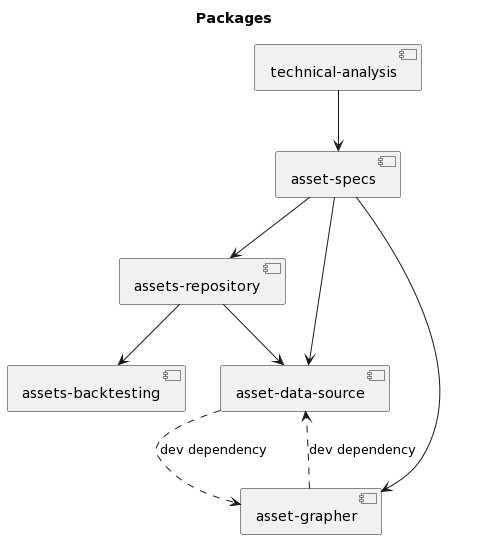

# Trading Design for an Automated Trading System

This automated trading system is designed to analyze financial data and execute trades on behalf of the user. The system uses advanced algorithms based on technical analysis, market trends, and risk management strategies to identify profitable trading opportunities and execute trades at lightning speed.

## Features

* Real-time monitoring: the system provides real-time monitoring of trading activities, allowing the user to track performance and adjust strategies as needed
* 24/7 operation: the system can operate around the clock, making trades at any time of day or night
* Automated analysis: the system uses advanced algorithms to analyze financial data, identifying profitable trading opportunities and minimizing risk
* Diversified trading strategies: the system can be customized to trade in various financial markets, including stocks, futures, options, commodities, and bonds
* Backtesting and optimization: the system can be backtested to evaluate its performance in historical market conditions, and optimized to improve its performance in future market conditions

## Design

High level design of different components of the automated trading system: 

